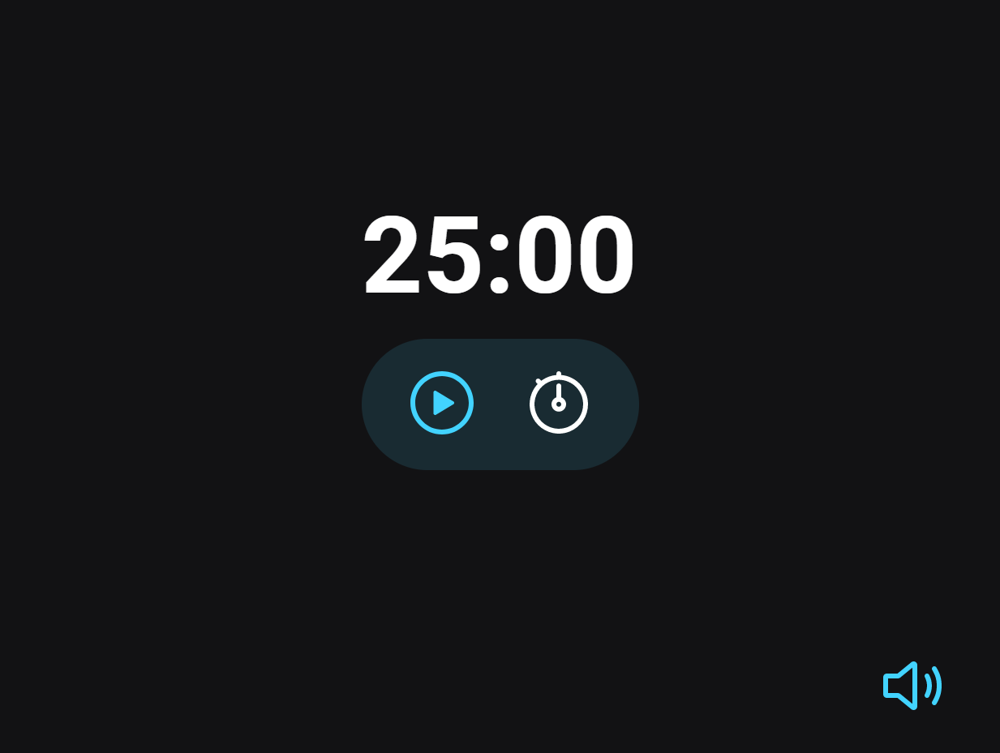

  

 
<h1 align="center"> 
	 Projeto 03 - Focus Timer - Pomodoro | Stage 05 🚀 
</h1>

  <a href="https://focus-timer-rho.vercel.app/" targert="_blank"> ▶️ Visualizar Página </a>

 

<h2 align=left> 💡​ Info. sobre o projeto </h2>

 Terceiro projeto do stage 05 do programa <strong>Explorer</strong> da <a href="https://www.rocketseat.com.br/"> <strong>Rocketseat</strong></a>.

Foi desenvolvido um Focus Timer baseado na técnica Pomodoro, a técnica consiste na utilização de um cronômetro para dividir o trabalho em períodos de 25 minutos, separados por breves intervalos.

 

<h2 align=left> 🧰​ Tecnologias</h2>

  
  
  
  

 

<h2>🖥️ Focus Timer - Pomodoro </h2>

 
 

<h2>​📧​​ Contato </h2>

  
  
   
 

